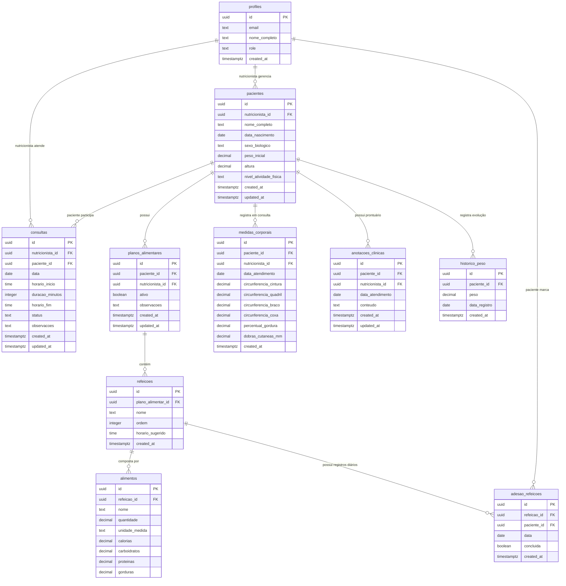

# Modelagem do Banco de Dados — NutriSmart

Documento central de referência para a estrutura do banco de dados do projeto **NutriSmart** (MVP v1.1).

---

## 1. Visão Geral

Este documento define o modelo conceitual, lógico e físico do banco de dados relacional da aplicação **NutriSmart**. Ele serve como especificação oficial para a persistência de dados, garantindo alinhamento entre as regras de negócio ([ERS](file:///C:/Users/heber%20bringel/Documents/workspaces/engenharia_de_software/nutri-smart-trabalho-final/nutri-smart/docs/Context/ERS.md)), arquitetura ([ADR 0002](file:///C:/Users/heber%20bringel/Documents/workspaces/engenharia_de_software/nutri-smart-trabalho-final/nutri-smart/docs/ADRs/0002-escolha-do-estilo-e-organizacao-de-codigo.md), [ADR 0003](file:///C:/Users/heber%20bringel/Documents/workspaces/engenharia_de_software/nutri-smart-trabalho-final/nutri-smart/docs/ADRs/0003-definicao-da-stack-tecnologica-do-mvp.md), [ADR 0004](file:///C:/Users/heber%20bringel/Documents/workspaces/engenharia_de_software/nutri-smart-trabalho-final/nutri-smart/docs/ADRs/0004-autenticacao-controle-de-acesso.md)) e privacidade de dados (LGPD).

---

## 2. Tecnologias Utilizadas

- **BaaS / Infraestrutura:** Supabase (Free Tier)
- **SGBD:** PostgreSQL 15+
- **Autenticação:** Supabase Auth (`auth.users`) + JWT
- **Segurança de Dados:** Row Level Security (RLS) habilitado em 100% das tabelas do esquema público
- **Extensões do PostgreSQL:** `uuid-ossp` (geração de UUIDs)

---

## 3. Convenções de Nomenclatura

- **Tabelas:** Nomeadas no plural em português, usando `snake_case` (ex.: `pacientes`, `planos_alimentares`).
- **Colunas:** Nomeadas em `snake_case` em português (ex.: `data_nascimento`, `nivel_atividade_fisica`).
- **Chaves Primárias (PK):** Coluna `id` do tipo `uuid` com padrão `gen_random_uuid()`.
- **Chaves Estrangeiras (FK):** Nomeadas como `<entidade_singular>_id` (ex.: `paciente_id`, `nutricionista_id`).
- **Campos de Auditoria:** `created_at` e `updated_at` com tipo `timestamptz`.
- **Restrições de Valores:** Utilização de `text` acompanhado de restrições `CHECK` nativas do SQL, evitando o uso de tipos `ENUM` customizados para facilitar manutenções e migrações.

---

## 4. Minimundo

O **NutriSmart** é uma plataforma SaaS para gestão de atendimentos nutricionais. 

1. **Acesso e Perfis:** O nutricionista se cadastra no sistema (armazenado no `auth.users` e espelhado em `profiles` com `role = 'nutricionista'`). O nutricionista cadastra seus pacientes, criando perfis vinculados (`role = 'paciente'`).
2. **Prontuário e Cadastro:** Cada paciente possui dados antropométricos básicos (peso, altura, data de nascimento, sexo biológico e nível de atividade física), usados para cálculo automatizado de TMB (Mifflin-St Jeor), GET e IMC.
3. **Planos Alimentares:** O nutricionista elabora planos alimentares estruturados por refeições e alimentos (com calorias e macronutrientes). Apenas um plano por paciente possui status `ativo = true` por vez.
4. **Adesão Diária:** O paciente acessa o sistema para visualizar seu plano ativo e registrar o cumprimento diário de cada refeição (`adesao_refeicoes`), permitindo o cálculo de métricas de adesão.
5. **Avaliação Clínica e Evolução:** A cada atendimento, o nutricionista registra medições corporais (circunferências, dobras cutâneas e % de gordura) e histórico de peso para acompanhamento temporal.
6. **Anotações Clínicas Prontuário:** O nutricionista registra anotações clínicas sobre as consultas. Por exigência da LGPD (Art. 11), estas anotações são de acesso estrito e exclusivo do nutricionista responsável, sendo inacessíveis para o paciente.
7. **Agendamento de Consultas:** Nutricionista e paciente gerenciam a agenda de atendimentos, com validações para impedir sobreposição de horários para um mesmo nutricionista.
8. **Exclusão de Dados (LGPD Art. 18):** Ao excluir um paciente, todos os seus dados vinculados (planos, medições, anotações, histórico, agendamentos e adesão) são removidos em cascata (`ON DELETE CASCADE`).

---

## 5. Modelo Conceitual (DER)



---

## 6. Modelo Lógico (Mapeamento de Tabelas)

### 6.1 `profiles`
Espelho público dos usuários cadastrados no `auth.users` do Supabase.
- `id` (`uuid`, PK, FK → `auth.users.id` ON DELETE CASCADE)
- `email` (`text`, NOT NULL)
- `nome_completo` (`text`, NOT NULL)
- `role` (`text`, NOT NULL, CHECK: `'nutricionista'`, `'paciente'`)
- `created_at` (`timestamptz`, DEFAULT `now()`)

### 6.2 `pacientes`
Cadastros de pacientes associados ao nutricionista responsável.
- `id` (`uuid`, PK, DEFAULT `gen_random_uuid()`)
- `nutricionista_id` (`uuid`, NOT NULL, FK → `profiles.id` ON DELETE CASCADE)
- `usuario_id` (`uuid`, NULL, FK → `profiles.id` ON DELETE SET NULL) -- Vinculo com o perfil de login do paciente
- `nome_completo` (`text`, NOT NULL)
- `data_nascimento` (`date`, NOT NULL)
- `sexo_biologico` (`text`, NOT NULL, CHECK: `'masculino'`, `'feminino'`)
- `peso_inicial` (`numeric(5,2)`, NOT NULL, CHECK > 0)
- `altura` (`numeric(5,2)`, NOT NULL, CHECK > 0) -- em cm (ex: 175.00)
- `nivel_atividade_fisica` (`text`, NOT NULL, CHECK: `'sedentario'`, `'levemente_ativo'`, `'moderadamente_ativo'`, `'muito_ativo'`, `'extremamente_ativo'`)
- `created_at` (`timestamptz`, DEFAULT `now()`)
- `updated_at` (`timestamptz`, DEFAULT `now()`)

### 6.3 `planos_alimentares`
Planos de alimentação elaborados para o paciente.
- `id` (`uuid`, PK, DEFAULT `gen_random_uuid()`)
- `paciente_id` (`uuid`, NOT NULL, FK → `pacientes.id` ON DELETE CASCADE)
- `nutricionista_id` (`uuid`, NOT NULL, FK → `profiles.id` ON DELETE CASCADE)
- `ativo` (`boolean`, NOT NULL DEFAULT true)
- `observacoes` (`text`)
- `created_at` (`timestamptz`, DEFAULT `now()`)
- `updated_at` (`timestamptz`, DEFAULT `now()`)

### 6.4 `refeicoes`
Refeições que integram um plano alimentar.
- `id` (`uuid`, PK, DEFAULT `gen_random_uuid()`)
- `plano_alimentar_id` (`uuid`, NOT NULL, FK → `planos_alimentares.id` ON DELETE CASCADE)
- `nome` (`text`, NOT NULL) -- Ex: "Café da Manhã", "Almoço"
- `ordem` (`integer`, NOT NULL DEFAULT 1)
- `horario_sugerido` (`time`)
- `created_at` (`timestamptz`, DEFAULT `now()`)

### 6.5 `alimentos`
Itens alimentares pertencentes a cada refeição.
- `id` (`uuid`, PK, DEFAULT `gen_random_uuid()`)
- `refeicao_id` (`uuid`, NOT NULL, FK → `refeicoes.id` ON DELETE CASCADE)
- `nome` (`text`, NOT NULL)
- `quantidade` (`numeric(7,2)`, NOT NULL, CHECK > 0)
- `unidade_medida` (`text`, NOT NULL DEFAULT 'g') -- Ex: "g", "ml", "unidade"
- `calorias` (`numeric(7,2)`, NOT NULL DEFAULT 0, CHECK >= 0)
- `carboidratos` (`numeric(6,2)`, DEFAULT 0, CHECK >= 0)
- `proteinas` (`numeric(6,2)`, DEFAULT 0, CHECK >= 0)
- `gorduras` (`numeric(6,2)`, DEFAULT 0, CHECK >= 0)

### 6.6 `adesao_refeicoes`
Registros diários efetuados pelo paciente sobre o cumprimento das refeições.
- `id` (`uuid`, PK, DEFAULT `gen_random_uuid()`)
- `refeicao_id` (`uuid`, NOT NULL, FK → `refeicoes.id` ON DELETE CASCADE)
- `paciente_id` (`uuid`, NOT NULL, FK → `pacientes.id` ON DELETE CASCADE)
- `data` (`date`, NOT NULL DEFAULT `CURRENT_DATE`)
- `concluida` (`boolean`, NOT NULL DEFAULT false)
- `created_at` (`timestamptz`, DEFAULT `now()`)
- Restrição UNIQUE (`refeicao_id`, `data`)

### 6.7 `historico_peso`
Acompanhamento temporal de peso do paciente.
- `id` (`uuid`, PK, DEFAULT `gen_random_uuid()`)
- `paciente_id` (`uuid`, NOT NULL, FK → `pacientes.id` ON DELETE CASCADE)
- `peso` (`numeric(5,2)`, NOT NULL, CHECK > 0)
- `data_registro` (`date`, NOT NULL DEFAULT `CURRENT_DATE`)
- `created_at` (`timestamptz`, DEFAULT `now()`)

### 6.8 `medidas_corporais`
Registro de antropometria coletada durante atendimentos presenciais/online.
- `id` (`uuid`, PK, DEFAULT `gen_random_uuid()`)
- `paciente_id` (`uuid`, NOT NULL, FK → `pacientes.id` ON DELETE CASCADE)
- `nutricionista_id` (`uuid`, NOT NULL, FK → `profiles.id` ON DELETE CASCADE)
- `data_atendimento` (`date`, NOT NULL DEFAULT `CURRENT_DATE`)
- `circunferencia_cintura` (`numeric(5,2)`, CHECK >= 0)
- `circunferencia_quadril` (`numeric(5,2)`, CHECK >= 0)
- `circunferencia_braco` (`numeric(5,2)`, CHECK >= 0)
- `circunferencia_coxa` (`numeric(5,2)`, CHECK >= 0)
- `percentual_gordura` (`numeric(4,2)`, CHECK >= 0 AND CHECK <= 100)
- `dobras_cutaneas_mm` (`numeric(5,2)`, CHECK >= 0)
- `created_at` (`timestamptz`, DEFAULT `now()`)

### 6.9 `anotacoes_clinicas`
Prontuário clínico restrito do nutricionista sobre o paciente (dados sensíveis LGPD Art. 11).
- `id` (`uuid`, PK, DEFAULT `gen_random_uuid()`)
- `paciente_id` (`uuid`, NOT NULL, FK → `pacientes.id` ON DELETE CASCADE)
- `nutricionista_id` (`uuid`, NOT NULL, FK → `profiles.id` ON DELETE CASCADE)
- `data_atendimento` (`date`, NOT NULL DEFAULT `CURRENT_DATE`)
- `conteudo` (`text`, NOT NULL)
- `created_at` (`timestamptz`, DEFAULT `now()`)
- `updated_at` (`timestamptz`, DEFAULT `now()`)

### 6.10 `consultas`
Agendamento e histórico de consultas nutricionais.
- `id` (`uuid`, PK, DEFAULT `gen_random_uuid()`)
- `nutricionista_id` (`uuid`, NOT NULL, FK → `profiles.id` ON DELETE CASCADE)
- `paciente_id` (`uuid`, NOT NULL, FK → `pacientes.id` ON DELETE CASCADE)
- `data` (`date`, NOT NULL)
- `horario_inicio` (`time`, NOT NULL)
- `duracao_minutos` (`integer`, NOT NULL DEFAULT 60, CHECK > 0)
- `horario_fim` (`time`, NOT NULL)
- `status` (`text`, NOT NULL DEFAULT 'agendada', CHECK: `'agendada'`, `'realizada'`, `'cancelada'`)
- `observacoes` (`text`)
- `created_at` (`timestamptz`, DEFAULT `now()`)
- `updated_at` (`timestamptz`, DEFAULT `now()`)

---

## 7. Modelo Físico (DDL SQL)

Abaixo encontra-se o script DDL completo em SQL padrão PostgreSQL para execução no editor de SQL do Supabase.

```sql
-- Habilita extensão para geração de UUID
CREATE EXTENSION IF NOT EXISTS "uuid-ossp";

-- 1. Tabela profiles (vinculada ao Supabase Auth)
CREATE TABLE public.profiles (
    id UUID PRIMARY KEY REFERENCES auth.users(id) ON DELETE CASCADE,
    email TEXT NOT NULL,
    nome_completo TEXT NOT NULL,
    role TEXT NOT NULL CONSTRAINT chk_profiles_role CHECK (role IN ('nutricionista', 'paciente')),
    created_at TIMESTAMPTZ NOT NULL DEFAULT now()
);

-- 2. Tabela pacientes
CREATE TABLE public.pacientes (
    id UUID PRIMARY KEY DEFAULT gen_random_uuid(),
    nutricionista_id UUID NOT NULL REFERENCES public.profiles(id) ON DELETE CASCADE,
    usuario_id UUID REFERENCES public.profiles(id) ON DELETE SET NULL,
    nome_completo TEXT NOT NULL,
    data_nascimento DATE NOT NULL,
    sexo_biologico TEXT NOT NULL CONSTRAINT chk_pacientes_sexo CHECK (sexo_biologico IN ('masculino', 'feminino')),
    peso_inicial NUMERIC(5,2) NOT NULL CONSTRAINT chk_pacientes_peso CHECK (peso_inicial > 0),
    altura NUMERIC(5,2) NOT NULL CONSTRAINT chk_pacientes_altura CHECK (altura > 0),
    nivel_atividade_fisica TEXT NOT NULL CONSTRAINT chk_pacientes_atividade CHECK (
        nivel_atividade_fisica IN (
            'sedentario',
            'levemente_ativo',
            'moderadamente_ativo',
            'muito_ativo',
            'extremamente_ativo'
        )
    ),
    created_at TIMESTAMPTZ NOT NULL DEFAULT now(),
    updated_at TIMESTAMPTZ NOT NULL DEFAULT now()
);

-- 3. Tabela planos_alimentares
CREATE TABLE public.planos_alimentares (
    id UUID PRIMARY KEY DEFAULT gen_random_uuid(),
    paciente_id UUID NOT NULL REFERENCES public.pacientes(id) ON DELETE CASCADE,
    nutricionista_id UUID NOT NULL REFERENCES public.profiles(id) ON DELETE CASCADE,
    ativo BOOLEAN NOT NULL DEFAULT true,
    observacoes TEXT,
    created_at TIMESTAMPTZ NOT NULL DEFAULT now(),
    updated_at TIMESTAMPTZ NOT NULL DEFAULT now()
);

-- 4. Tabela refeicoes
CREATE TABLE public.refeicoes (
    id UUID PRIMARY KEY DEFAULT gen_random_uuid(),
    plano_alimentar_id UUID NOT NULL REFERENCES public.planos_alimentares(id) ON DELETE CASCADE,
    nome TEXT NOT NULL,
    ordem INTEGER NOT NULL DEFAULT 1,
    horario_sugerido TIME,
    created_at TIMESTAMPTZ NOT NULL DEFAULT now()
);

-- 5. Tabela alimentos
CREATE TABLE public.alimentos (
    id UUID PRIMARY KEY DEFAULT gen_random_uuid(),
    refeicao_id UUID NOT NULL REFERENCES public.refeicoes(id) ON DELETE CASCADE,
    nome TEXT NOT NULL,
    quantidade NUMERIC(7,2) NOT NULL CONSTRAINT chk_alimentos_qtd CHECK (quantidade > 0),
    unidade_medida TEXT NOT NULL DEFAULT 'g',
    calorias NUMERIC(7,2) NOT NULL DEFAULT 0 CONSTRAINT chk_alimentos_cal CHECK (calorias >= 0),
    carboidratos NUMERIC(6,2) DEFAULT 0 CONSTRAINT chk_alimentos_carb CHECK (carboidratos >= 0),
    proteinas NUMERIC(6,2) DEFAULT 0 CONSTRAINT chk_alimentos_prot CHECK (proteinas >= 0),
    gorduras NUMERIC(6,2) DEFAULT 0 CONSTRAINT chk_alimentos_gord CHECK (gorduras >= 0)
);

-- 6. Tabela adesao_refeicoes
CREATE TABLE public.adesao_refeicoes (
    id UUID PRIMARY KEY DEFAULT gen_random_uuid(),
    refeicao_id UUID NOT NULL REFERENCES public.refeicoes(id) ON DELETE CASCADE,
    paciente_id UUID NOT NULL REFERENCES public.pacientes(id) ON DELETE CASCADE,
    data DATE NOT NULL DEFAULT CURRENT_DATE,
    concluida BOOLEAN NOT NULL DEFAULT false,
    created_at TIMESTAMPTZ NOT NULL DEFAULT now(),
    CONSTRAINT unq_adesao_refeicao_data UNIQUE (refeicao_id, data)
);

-- 7. Tabela historico_peso
CREATE TABLE public.historico_peso (
    id UUID PRIMARY KEY DEFAULT gen_random_uuid(),
    paciente_id UUID NOT NULL REFERENCES public.pacientes(id) ON DELETE CASCADE,
    peso NUMERIC(5,2) NOT NULL CONSTRAINT chk_historico_peso CHECK (peso > 0),
    data_registro DATE NOT NULL DEFAULT CURRENT_DATE,
    created_at TIMESTAMPTZ NOT NULL DEFAULT now()
);

-- 8. Tabela medidas_corporais
CREATE TABLE public.medidas_corporais (
    id UUID PRIMARY KEY DEFAULT gen_random_uuid(),
    paciente_id UUID NOT NULL REFERENCES public.pacientes(id) ON DELETE CASCADE,
    nutricionista_id UUID NOT NULL REFERENCES public.profiles(id) ON DELETE CASCADE,
    data_atendimento DATE NOT NULL DEFAULT CURRENT_DATE,
    circunferencia_cintura NUMERIC(5,2) CONSTRAINT chk_medidas_cintura CHECK (circunferencia_cintura >= 0),
    circunferencia_quadril NUMERIC(5,2) CONSTRAINT chk_medidas_quadril CHECK (circunferencia_quadril >= 0),
    circunferencia_braco NUMERIC(5,2) CONSTRAINT chk_medidas_braco CHECK (circunferencia_braco >= 0),
    circunferencia_coxa NUMERIC(5,2) CONSTRAINT chk_medidas_coxa CHECK (circunferencia_coxa >= 0),
    percentual_gordura NUMERIC(4,2) CONSTRAINT chk_medidas_gordura CHECK (percentual_gordura >= 0 AND percentual_gordura <= 100),
    dobras_cutaneas_mm NUMERIC(5,2) CONSTRAINT chk_medidas_dobras CHECK (dobras_cutaneas_mm >= 0),
    created_at TIMESTAMPTZ NOT NULL DEFAULT now()
);

-- 9. Tabela anotacoes_clinicas (LGPD - Restrito ao nutricionista)
CREATE TABLE public.anotacoes_clinicas (
    id UUID PRIMARY KEY DEFAULT gen_random_uuid(),
    paciente_id UUID NOT NULL REFERENCES public.pacientes(id) ON DELETE CASCADE,
    nutricionista_id UUID NOT NULL REFERENCES public.profiles(id) ON DELETE CASCADE,
    data_atendimento DATE NOT NULL DEFAULT CURRENT_DATE,
    conteudo TEXT NOT NULL,
    created_at TIMESTAMPTZ NOT NULL DEFAULT now(),
    updated_at TIMESTAMPTZ NOT NULL DEFAULT now()
);

-- 10. Tabela consultas
CREATE TABLE public.consultas (
    id UUID PRIMARY KEY DEFAULT gen_random_uuid(),
    nutricionista_id UUID NOT NULL REFERENCES public.profiles(id) ON DELETE CASCADE,
    paciente_id UUID NOT NULL REFERENCES public.pacientes(id) ON DELETE CASCADE,
    data DATE NOT NULL,
    horario_inicio TIME NOT NULL,
    duracao_minutos INTEGER NOT NULL DEFAULT 60 CONSTRAINT chk_consultas_duracao CHECK (duracao_minutos > 0),
    horario_fim TIME NOT NULL,
    status TEXT NOT NULL DEFAULT 'agendada' CONSTRAINT chk_consultas_status CHECK (status IN ('agendada', 'realizada', 'cancelada')),
    observacoes TEXT,
    created_at TIMESTAMPTZ NOT NULL DEFAULT now(),
    updated_at TIMESTAMPTZ NOT NULL DEFAULT now()
);
```

---

## 8. Regras de Integridade e Validação

1. **Validação de Enums via `CHECK`:** Todos os campos de opção pré-definida (`role`, `sexo_biologico`, `nivel_atividade_fisica`, `status`) utilizam restrições `CHECK` SQL para garantir integridade sem dependência de tipos de enum customizados no SGBD.
2. **Exclusão LGPD (`ON DELETE CASCADE`):** Todas as chaves estrangeiras que ligam registros a `pacientes` ou `profiles` utilizam remoção em cascata, garantindo cumprimento do direito ao esquecimento (Art. 18 LGPD).
3. **Unicidade de Adesão Diária:** Constraint `UNIQUE (refeicao_id, data)` na tabela `adesao_refeicoes` previne que o paciente registre duplicidade de conclusão para a mesma refeição no mesmo dia.
4. **Prevenção de Conflitos na Agenda (RF032):** Na camada de aplicação/serviço (via `IAgendamentoValidator` / Strategy GoF) e/ou trigger PostgreSQL, valida-se se o intervalo `[horario_inicio, horario_fim]` de uma nova consulta não se sobrepõe a uma consulta existente com `status = 'agendada'` para o mesmo `nutricionista_id` no mesmo dia.

---

## 9. Políticas de Segurança (Row Level Security - RLS)

Para atender ao **RF018** e ao **ADR 0004**, o Row Level Security é ativado em todas as tabelas.

```sql
-- Habilita RLS em todas as tabelas
ALTER TABLE public.profiles ENABLE ROW LEVEL SECURITY;
ALTER TABLE public.pacientes ENABLE ROW LEVEL SECURITY;
ALTER TABLE public.planos_alimentares ENABLE ROW LEVEL SECURITY;
ALTER TABLE public.refeicoes ENABLE ROW LEVEL SECURITY;
ALTER TABLE public.alimentos ENABLE ROW LEVEL SECURITY;
ALTER TABLE public.adesao_refeicoes ENABLE ROW LEVEL SECURITY;
ALTER TABLE public.historico_peso ENABLE ROW LEVEL SECURITY;
ALTER TABLE public.medidas_corporais ENABLE ROW LEVEL SECURITY;
ALTER TABLE public.anotacoes_clinicas ENABLE ROW LEVEL SECURITY;
ALTER TABLE public.consultas ENABLE ROW LEVEL SECURITY;

-- POLÍTICAS: profiles
CREATE POLICY "profiles_select_self" ON public.profiles FOR SELECT USING (auth.uid() = id);
CREATE POLICY "profiles_update_self" ON public.profiles FOR UPDATE USING (auth.uid() = id);

-- POLÍTICAS: pacientes
CREATE POLICY "pacientes_nutricionista_all" ON public.pacientes 
    FOR ALL USING (auth.uid() = nutricionista_id);
CREATE POLICY "pacientes_self_select" ON public.pacientes 
    FOR SELECT USING (auth.uid() = usuario_id);

-- POLÍTICAS: planos_alimentares
CREATE POLICY "planos_nutricionista_all" ON public.planos_alimentares 
    FOR ALL USING (auth.uid() = nutricionista_id);
CREATE POLICY "planos_paciente_select" ON public.planos_alimentares 
    FOR SELECT USING (
        paciente_id IN (SELECT id FROM public.pacientes WHERE usuario_id = auth.uid())
    );

-- POLÍTICAS: refeicoes e alimentos
CREATE POLICY "refeicoes_nutricionista_all" ON public.refeicoes 
    FOR ALL USING (
        plano_alimentar_id IN (SELECT id FROM public.planos_alimentares WHERE nutricionista_id = auth.uid())
    );
CREATE POLICY "refeicoes_paciente_select" ON public.refeicoes 
    FOR SELECT USING (
        plano_alimentar_id IN (
            SELECT p.id FROM public.planos_alimentares p
            JOIN public.pacientes pac ON p.paciente_id = pac.id
            WHERE pac.usuario_id = auth.uid()
        )
    );

CREATE POLICY "alimentos_nutricionista_all" ON public.alimentos 
    FOR ALL USING (
        refeicao_id IN (
            SELECT r.id FROM public.refeicoes r 
            JOIN public.planos_alimentares p ON r.plano_alimentar_id = p.id 
            WHERE p.nutricionista_id = auth.uid()
        )
    );
CREATE POLICY "alimentos_paciente_select" ON public.alimentos 
    FOR SELECT USING (
        refeicao_id IN (
            SELECT r.id FROM public.refeicoes r
            JOIN public.planos_alimentares p ON r.plano_alimentar_id = p.id
            JOIN public.pacientes pac ON p.paciente_id = pac.id
            WHERE pac.usuario_id = auth.uid()
        )
    );

-- POLÍTICAS: adesao_refeicoes
CREATE POLICY "adesao_paciente_all" ON public.adesao_refeicoes 
    FOR ALL USING (
        paciente_id IN (SELECT id FROM public.pacientes WHERE usuario_id = auth.uid())
    );
CREATE POLICY "adesao_nutricionista_select" ON public.adesao_refeicoes 
    FOR SELECT USING (
        refeicao_id IN (
            SELECT r.id FROM public.refeicoes r 
            JOIN public.planos_alimentares p ON r.plano_alimentar_id = p.id 
            WHERE p.nutricionista_id = auth.uid()
        )
    );

-- POLÍTICAS: medidas_corporais e historico_peso
CREATE POLICY "medidas_nutricionista_all" ON public.medidas_corporais 
    FOR ALL USING (auth.uid() = nutricionista_id);
CREATE POLICY "medidas_paciente_select" ON public.medidas_corporais 
    FOR SELECT USING (
        paciente_id IN (SELECT id FROM public.pacientes WHERE usuario_id = auth.uid())
    );

CREATE POLICY "historico_peso_nutricionista_all" ON public.historico_peso 
    FOR ALL USING (
        paciente_id IN (SELECT id FROM public.pacientes WHERE nutricionista_id = auth.uid())
    );
CREATE POLICY "historico_peso_paciente_select" ON public.historico_peso 
    FOR SELECT USING (
        paciente_id IN (SELECT id FROM public.pacientes WHERE usuario_id = auth.uid())
    );

-- POLÍTICAS: anotacoes_clinicas (SIGILO ABSOLUTO LGPD ART. 11 - Apenas o Nutricionista acessa)
CREATE POLICY "anotacoes_nutricionista_only" ON public.anotacoes_clinicas 
    FOR ALL USING (auth.uid() = nutricionista_id);
-- Nota: Nenhuma política SELECT é criada para o perfil paciente nesta tabela.

-- POLÍTICAS: consultas
CREATE POLICY "consultas_nutricionista_all" ON public.consultas 
    FOR ALL USING (auth.uid() = nutricionista_id);
CREATE POLICY "consultas_paciente_select" ON public.consultas 
    FOR SELECT USING (
        paciente_id IN (SELECT id FROM public.pacientes WHERE usuario_id = auth.uid())
    );
```

---

## 10. Índices de Desempenho

```sql
-- Índices para buscas por Chaves Estrangeiras frequentes
CREATE INDEX idx_pacientes_nutricionista ON public.pacientes(nutricionista_id);
CREATE INDEX idx_planos_paciente ON public.planos_alimentares(paciente_id);
CREATE INDEX idx_planos_ativo ON public.planos_alimentares(paciente_id) WHERE ativo = true;
CREATE INDEX idx_refeicoes_plano ON public.refeicoes(plano_alimentar_id);
CREATE INDEX idx_alimentos_refeicao ON public.alimentos(refeicao_id);
CREATE INDEX idx_adesao_paciente_data ON public.adesao_refeicoes(paciente_id, data);
CREATE INDEX idx_medidas_paciente_data ON public.medidas_corporais(paciente_id, data_atendimento DESC);
CREATE INDEX idx_anotacoes_paciente_data ON public.anotacoes_clinicas(paciente_id, data_atendimento DESC);
CREATE INDEX idx_consultas_nutri_data ON public.consultas(nutricionista_id, data);
CREATE INDEX idx_consultas_paciente ON public.consultas(paciente_id);
```

---

## 11. Fluxos Importantes

### 11.1 Cadastro de Paciente e Cálculo Clínico Instantâneo
1. O nutricionista cadastra o paciente informando `peso_inicial`, `altura`, `data_nascimento`, `sexo_biologico` e `nivel_atividade_fisica`.
2. A aplicação calcula na camada domain/usecase:
   - **IMC:** $\text{peso} / (\text{altura in m})^2$
   - **TMB (Mifflin-St Jeor):**
     - Homem: $10 \times \text{peso} + 6.25 \times \text{altura(cm)} - 5 \times \text{idade} + 5$
     - Mulher: $10 \times \text{peso} + 6.25 \times \text{altura(cm)} - 5 \times \text{idade} - 161$
   - **GET (Gasto Energético Total):** $\text{TMB} \times \text{fator\_atividade}$

### 11.2 Exclusão de Paciente (Direito ao Esquecimento)
Ao executar `DELETE FROM pacientes WHERE id = :id;`, as restrições `ON DELETE CASCADE` garantem a remoção atômica de:
- Planos alimentares, refeições e alimentos
- Histórico de peso e medições corporais
- Anotações clínicas e prontuário
- Consultas agendadas e adesões

---

## 12. Roadmap / Futuras Alterações (Candidatas a v2)

Conforme seção "Fora de Escopo" do [PRD](file:///C:/Users/heber%20bringel/Documents/workspaces/engenharia_de_software/nutri-smart-trabalho-final/nutri-smart/docs/PRD/prd.md):
- **Tabela `notificacoes_whatsapp`:** Para registros de envio via WhatsApp Business API.
- **Tabela `integracao_google_calendar`:** Para sincronização bidirecional de agendas.
- **Tabela `faturamento_planos`:** Para gestão financeira, mensalidades e gateways de pagamento.
- **Tabela `customizacao_tema`:** Para temas white-label por consultório.
