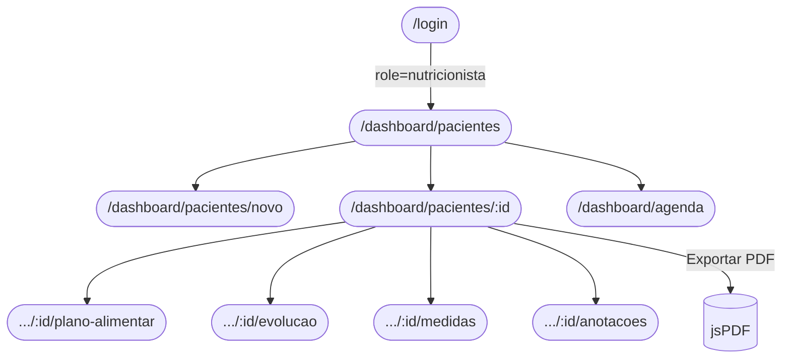
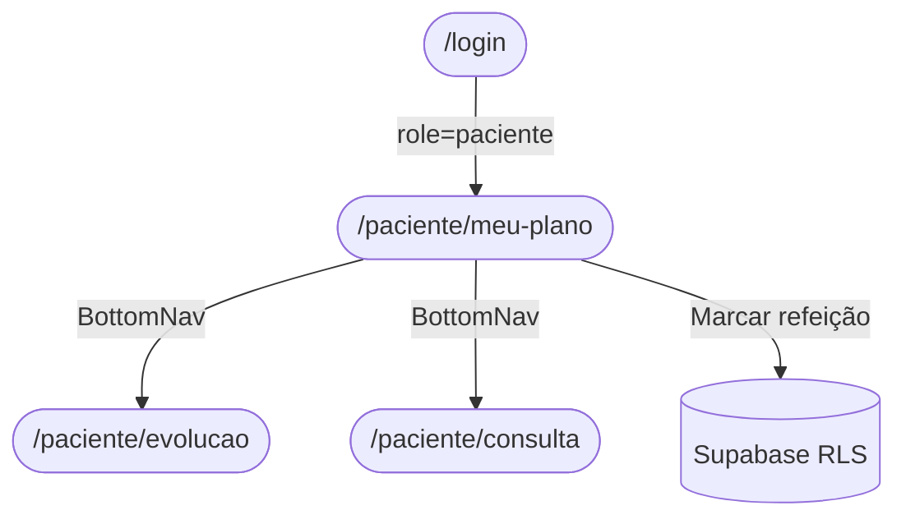

# UI System Design — NutriSmart

> Documento de referência para a camada de apresentação (`src/app/`).
> Versão alinhada com ERS v1.1, PRD, ADR 0002 e ADR 0003.

---

## 1. Visão Geral

O NutriSmart possui **dois perfis de usuário** com interfaces distintas:

| Perfil | Ponto de entrada pós-login | Área principal |
|---|---|---|
| **Nutricionista** | `/dashboard/pacientes` | Dashboard clínico com sidebar |
| **Paciente** | `/paciente/meu-plano` | Área minimalista, mobile-first |

A SPA é construída em **React 19+ com TypeScript + Vite**, estilizada com **Tailwind CSS**.

---

## 1.1 Filosofia de Design

> **Tecnologia · Simplicidade · Minimalismo**

O NutriSmart segue a escola de design de produtos como **Linear**, **Vercel** e **Notion**: interfaces que desaparecem para dar lugar ao conteúdo.

### Princípios

| Princípio | Diretriz prática |
|---|---|
| **Uma única cor de acento** | Apenas `emerald-500` (`#10B981`) tem cor. Tudo mais é neutro. |
| **Tipografia como hierarquia** | Peso e tamanho da fonte substituem cor para comunicar importância. |
| **Espaço como elemento** | Whitespace generoso não é ausência de design — é o design. |
| **Sem decoração** | Zero gradientes, zero sombras pesadas, zero bordas coloridas. Bordas são `1px #E5E5E5`. |
| **Dados em foco** | A interface recua; números, nomes e status ficam em evidência. |
| **Feedback preciso** | Animações existem apenas para comunicar estado (loading, success, error). |

### Referências Visuais

- [Linear](https://linear.app) — sidebar escura, conteúdo claro, tipografia dominante
- [Vercel Dashboard](https://vercel.com/dashboard) — tabelas minimalistas, badges monocromáticos
- [Raycast](https://raycast.com) — precisão tipográfica, paleta neutra

---

## 2. Design Tokens

### 2.1 Paleta de Cores

> **Regra de ouro:** somente `--accent` tem cor. Todos os outros tokens são gradações de neutro.

#### Neutros (base do sistema)

| Token | Valor hex | Tailwind equiv. | Uso |
|---|---|---|---|
| `--bg-page` | `#FAFAFA` | `neutral-50` | Fundo geral da página |
| `--bg-surface` | `#FFFFFF` | `white` | Cards, painéis |
| `--bg-subtle` | `#F5F5F5` | `neutral-100` | Hover de linhas, fundo de input |
| `--border` | `#E5E5E5` | `neutral-200` | Bordas de cards, inputs, divisores |
| `--border-strong` | `#D4D4D4` | `neutral-300` | Bordas em foco, separadores marcantes |
| `--text-primary` | `#111827` | `gray-900` | Títulos, dados primários |
| `--text-secondary` | `#6B7280` | `gray-500` | Labels, subtextos, metadados |
| `--text-tertiary` | `#9CA3AF` | `gray-400` | Placeholders, textos desabilitados |

#### Acento único (emerald)

| Token | Valor hex | Tailwind equiv. | Uso |
|---|---|---|---|
| `--accent` | `#10B981` | `emerald-500` | Botão primário, link ativo, badge de status positivo, borda ativa da sidebar |
| `--accent-hover` | `#059669` | `emerald-600` | Hover do botão primário |
| `--accent-subtle` | `#ECFDF5` | `emerald-50` | Fundo de badge "Ativo", highlight de linha |
| `--accent-text` | `#065F46` | `emerald-900` | Texto dentro de badge "Ativo" |

#### Semânticos (neutros com significado)

| Token | Valor hex | Uso |
|---|---|---|
| `--danger` | `#EF4444` | Erros, exclusões, ações destrutivas |
| `--danger-subtle` | `#FEF2F2` | Fundo de mensagem de erro |
| `--warning` | `#F59E0B` | Alertas, conflitos |
| `--warning-subtle` | `#FFFBEB` | Fundo de aviso |

#### Sidebar (nutricionista)

| Token | Valor hex | Uso |
|---|---|---|
| `--sidebar-bg` | `#0A0A0A` | Fundo da sidebar — near-black |
| `--sidebar-text` | `#A3A3A3` | Ícones e labels inativos |
| `--sidebar-text-active` | `#FFFFFF` | Item ativo |
| `--sidebar-accent-border` | `#10B981` | Borda esquerda do item ativo (2px) |

### 2.2 Tipografia

> Fonte primária: **Inter** (Google Fonts). Números e dados clínicos: **JetBrains Mono**.

```html
<!-- No index.html -->
<link href="https://fonts.googleapis.com/css2?family=Inter:wght@400;500;600;700&family=JetBrains+Mono:wght@400;500&display=swap" rel="stylesheet">
```

| Papel | Família | Peso | Tamanho | Uso |
|---|---|---|---|---|
| `heading-xl` | Inter | 700 | 24px | Títulos de página |
| `heading-lg` | Inter | 600 | 20px | Títulos de seção |
| `heading-md` | Inter | 600 | 16px | Subtítulos de card |
| `body` | Inter | 400 | 14px | Corpo de texto padrão |
| `body-sm` | Inter | 400 | 12px | Labels, metadados |
| `data` | JetBrains Mono | 500 | 14px | IMC, TMB, GET, calorias, datas |
| `data-lg` | JetBrains Mono | 400 | 20px | Valores de destaque no StatCard |
| `caption` | Inter | 400 | 11px | Rodapés de tabela, classificações |

### 2.3 Espaçamento

- Grid base: **4px** (unidade mínima). Todos os espaços são múltiplos de 4px.
- Padding interno de card: `p-6` (24px).
- Gap entre cards: `gap-4` (16px).
- Padding de página: `px-6 py-8`.
- Largura máxima do conteúdo: `max-w-5xl mx-auto`.
- Sidebar: `w-60` (240px) em desktop.

### 2.4 Bordas e Arredondamentos

| Elemento | Valor | Observação |
|---|---|---|
| Cards | `rounded-lg` (8px) | Sutil, não exagerado |
| Botões | `rounded-md` (6px) | Preciso, funcional |
| Inputs | `rounded-md` (6px) | Consistente com botões |
| Badges | `rounded-sm` (2px) | **Não** circular — mais técnico |
| Modais | `rounded-xl` (12px) | Leve elevação visual |
| Avatar | `rounded-full` | Único elemento circular |

### 2.5 Sombras

> Uso **mínimo e intencional**. Bordas substituem sombras na maioria dos casos.

| Contexto | Classe | Quando usar |
|---|---|---|
| Cards base | `border border-[#E5E5E5]` | **Sem sombra** — borda fina é suficiente |
| Dropdown / Popover | `shadow-lg` | Necessário para comunicar flutuação |
| Modal | `shadow-2xl` | Overlay precisa de profundidade |
| Tooltip | `shadow-md` | Mínimo para não poluir |

---

## 3. Componentes Globais

### 3.1 Layout — Nutricionista (`NutritionistLayout`)

```
┌─────────────────────────────────────────────────────┐
│  Topbar (#FFFFFF, h-12)                             │
│  ┌───────────────────────────────────────────────┐  │
│  │ · NutriSmart                     Agenda  (DS) │  │
│  └───────────────────────────────────────────────┘  │
│                                                     │
│                <Outlet />                           │
└─────────────────────────────────────────────────────┘
```

**Especificações do Layout:**
- **Sem sidebar vertical.** O sistema foca totalmente na área de trabalho.
- Header minimalista: `height 48px`, background `#FFFFFF`, border-bottom `1px solid #E5E5E5`.
- Logo à esquerda e navegação/avatar à direita.
- O conteúdo central (`Outlet`) deve usar uma largura máxima contida (ex: `max-w-5xl`) para não espalhar demais a informação em telas ultra-wide.

### 3.2 Layout — Paciente (`PatientLayout`)

```
┌─────────────────────────────────┐
│  Header (bg-white, shadow-sm)   │
│  Logo        [Avatar] [Sair]    │
│─────────────────────────────────│
│                                 │
│         <Outlet />              │
│                                 │
│─────────────────────────────────│
│  BottomNav (mobile only)        │
│  🍽️ Plano  📊 Evolução  📅 Consulta │
└─────────────────────────────────┘
```

### 3.3 Componentes Atômicos

| Componente | Props principais | Descrição |
|---|---|---|
| `Button` | `variant`, `size`, `loading`, `disabled` | Botão com variantes: `primary`, `secondary`, `danger`, `ghost` |
| `Input` | `label`, `error`, `helperText`, `required` | Campo de texto com feedback visual de erro |
| `Select` | `label`, `options`, `error` | Select com label flutuante |
| `Textarea` | `label`, `rows`, `error` | Textarea para anotações |
| `Badge` | `variant` | Status pill: `active`, `inactive`, `warning` |
| `Card` | `padding`, `shadow` | Container padrão de seção |
| `Modal` | `isOpen`, `onClose`, `title` | Overlay com foco aprisionado |
| `Spinner` | `size` | Loader para estados assíncronos |
| `EmptyState` | `icon`, `title`, `description`, `action` | Estado vazio de listas |
| `ConfirmDialog` | `message`, `onConfirm`, `onCancel` | Confirmação de ações destrutivas |
| `ProgressBar` | `value`, `max`, `label` | Barra de progresso de adesão |
| `StatCard` | `label`, `value`, `unit`, `trend` | Cartão de métrica (IMC, TMB, GET) |
| `ChartWrapper` | `title`, `children` | Container de gráfico com título e legenda |

---

## 4. Mapa de Telas

### 4.1 Visão Geral das Rotas

```
/login                                    ← Pública
/dashboard/pacientes                      ← Nutricionista
/dashboard/pacientes/novo                 ← Nutricionista
/dashboard/pacientes/:id                  ← Nutricionista
/dashboard/pacientes/:id/plano-alimentar  ← Nutricionista
/dashboard/pacientes/:id/evolucao         ← Nutricionista
/dashboard/pacientes/:id/medidas          ← Nutricionista
/dashboard/pacientes/:id/anotacoes        ← Nutricionista
/dashboard/agenda                         ← Nutricionista (a implementar)
/paciente/meu-plano                       ← Paciente
/paciente/evolucao                        ← Paciente (a implementar)
/paciente/consulta                        ← Paciente (a implementar)
```

---

## 5. Especificação de Telas

---

### TELA 01 — Login (`/login`)

**RF:** RF015, RF016, RF019
**HU:** HU-1, HU-2

#### Layout

```
┌──────────────────────────────────────────┐
│                                          │
│         [Logo NutriSmart]                │
│     Plataforma de Nutrição Clínica       │
│                                          │
│  ┌────────────────────────────────────┐  │
│  │  E-mail                            │  │
│  │  [_____________________________]   │  │
│  │                                    │  │
│  │  Senha                             │  │
│  │  [_____________________________]   │  │
│  │                                    │  │
│  │  [        Entrar            ]      │  │
│  │                                    │  │
│  │  Esqueceu a senha? →               │  │
│  └────────────────────────────────────┘  │
│                                          │
└──────────────────────────────────────────┘
```

#### Elementos

| ID | Tipo | Label | Validação |
|---|---|---|---|
| `input-email` | Input (email) | E-mail | Obrigatório, formato e-mail |
| `input-password` | Input (password) | Senha | Obrigatório, mín. 6 chars |
| `btn-login` | Button (primary) | Entrar | Desabilitado se form inválido |
| `link-forgot-password` | Link | Esqueceu a senha? | Navega para fluxo de recuperação |

#### Estados

- **Carregando:** botão exibe `Spinner` e texto "Entrando…"
- **Erro:** banner vermelho com mensagem de erro abaixo do botão
- **Sucesso:** redireciona para rota baseada no perfil (`role`)

---

### TELA 02 — Lista de Pacientes (`/dashboard/pacientes`)

**RF:** RF002, RF009
**HU:** HU-4, HU-5

#### Layout (Variante C: Command Palette)

```
┌────────────────────────────────────────────────────────┐
│                                                        │
│  [ ⌕ Buscar paciente por nome...     [+ Novo]  ]       │
│                                                        │
│  [Todos] [Com plano ativo] [Sem plano]      3 resultados │
│                                                        │
│  ┌─ Lista ─────────────────┐ ┌─ Detalhes ────────────┐ │
│  │ ▌ AS Ana Souza    ativo │ │  AS Ana Souza         │ │
│  │     atend. 10/06/2026   │ │                       │ │
│  │ ─────────────────────── │ │  IMC          24.1    │ │
│  │   JP João P.  sem plano │ │  GET          1840    │ │
│  │     atend. 05/05/2026   │ │  Adesão       87%     │ │
│  │ ─────────────────────── │ │  Último atend 10/06   │ │
│  │   ML Maria Lima   ativo │ │                       │ │
│  │     atend. 18/06/2026   │ │  [Abrir Ficha]        │ │
│  └─────────────────────────┘ └───────────────────────┘ │
└────────────────────────────────────────────────────────┘
```

#### Elementos

| ID | Tipo | Label | Comportamento |
|---|---|---|---|
| `input-search` | Input (search) | Buscar... | Input largo central, estilo command palette |
| `btn-new-patient` | Button (primary) | + Novo paciente | Dentro do campo de busca, à direita |
| `filter-chips` | Group | Todos / Com plano / Sem plano | Filtra lista em memória |
| `list-patients` | Div | — | Lista compacta de pacientes à esquerda |
| `panel-details` | Div | — | Exibe detalhes do paciente selecionado à direita |

#### Estados

- **Carregando:** skeleton loaders para a barra de busca e a lista
- **Nenhum paciente selecionado:** painel lateral exibe texto descritivo "Selecione um paciente para ver detalhes"
- **Nenhum resultado na busca:** lista exibe "Nenhum paciente encontrado"

---

### TELA 03 — Formulário de Paciente (`/dashboard/pacientes/novo`)

**RF:** RF001, RF004, RF005, RF006, RF035
**HU:** HU-3, HU-6, HU-22

#### Layout

```
┌─────────────────────────────────────────────────────┐
│  ← Pacientes  /  Novo Paciente                      │
│                                                     │
│  ┌── Dados Pessoais ──────────────────────────────┐ │
│  │  Nome completo *         Data de nascimento *  │ │
│  │  [_____________________] [____________________]│ │
│  │                                                │ │
│  │  E-mail para convite *                         │ │
│  │  [___________________________________________] │ │
│  │                                                │ │
│  │  Sexo biológico *                              │ │
│  │  ○ Masculino  ○ Feminino                       │ │
│  └────────────────────────────────────────────────┘ │
│                                                     │
│  ┌── Medidas Iniciais ────────────────────────────┐ │
│  │  Peso (kg) *             Altura (cm) *         │ │
│  │  [_____________________] [____________________]│ │
│  │                                                │ │
│  │  Nível de atividade física *                   │ │
│  │  [── Select ──────────────────────────────── ▾]│ │
│  └────────────────────────────────────────────────┘ │
│                                                     │
│  ┌── Indicadores (calculado automaticamente) ─────┐ │
│  │  IMC          TMB           GET                │ │
│  │  [StatCard]   [StatCard]    [StatCard]         │ │
│  └────────────────────────────────────────────────┘ │
│                                                     │
│                  [Cancelar]  [Salvar Paciente]      │
└─────────────────────────────────────────────────────┘
```

#### Campos do Formulário

| ID | Tipo | Label | Validação |
|---|---|---|---|
| `input-nome` | Input (text) | Nome completo | Obrigatório, mín. 3 chars |
| `input-email-paciente` | Input (email) | E-mail para convite | Obrigatório, formato válido e normalizado |
| `input-data-nascimento` | Input (date) | Data de nascimento | Obrigatório, data passada |
| `radio-sexo` | RadioGroup | Sexo biológico | Obrigatório |
| `input-peso` | Input (number) | Peso (kg) | Obrigatório, > 0, ≤ 300 |
| `input-altura` | Input (number) | Altura (cm) | Obrigatório, > 0, ≤ 250 |
| `select-atividade` | Select | Nível de atividade | Obrigatório |

#### Opções de Nível de Atividade

| Valor | Label |
|---|---|
| `sedentario` | Sedentário (fator 1,2) |
| `leve` | Levemente ativo (fator 1,375) |
| `moderado` | Moderadamente ativo (fator 1,55) |
| `muito_ativo` | Muito ativo (fator 1,725) |
| `extremamente_ativo` | Extremamente ativo (fator 1,9) |

#### Comportamento após o cadastro

- O salvamento clínico é concluído antes da solicitação do convite.
- O sistema informa apenas que o paciente foi cadastrado e que o convite foi solicitado.
- Falhas técnicas no envio são registradas silenciosamente e não transformam o cadastro em erro.
- Nenhuma senha temporária ou baseada em data de nascimento é exibida.

#### Indicadores Calculados (Preview em Tempo Real)

| StatCard | Fórmula | Classificação exibida |
|---|---|---|
| IMC | `peso / (altura/100)²` | Classificação OMS |
| TMB | Mifflin-St Jeor por sexo | kcal/dia |
| GET | `TMB × fator_atividade` | kcal/dia |

---

### TELA 04 — Perfil do Paciente (`/dashboard/pacientes/:id`)

**RF:** RF003, RF010, RF026, RF027, RF028
**HU:** HU-8, HU-13, HU-16, HU-17

#### Layout

```
┌─────────────────────────────────────────────────────┐
│  ← Pacientes  /  Ana Souza                          │
│                                                     │
│  ┌── Header do Paciente ──────────────────────────┐ │
│  │  [Avatar]  Ana Souza           [Editar] [PDF]  │ │
│  │            30 anos · Feminino                  │ │
│  │            Último atend: 10/06/2026            │ │
│  └────────────────────────────────────────────────┘ │
│                                                     │
│  ┌── Indicadores ─────────────────────────────────┐ │
│  │  [IMC StatCard] [TMB StatCard] [GET StatCard]  │ │
│  └────────────────────────────────────────────────┘ │
│                                                     │
│  ┌── Navegação Interna (Tabs) ────────────────────┐ │
│  │  Plano Alimentar │ Evolução │ Medidas │ Notas  │ │
│  └────────────────────────────────────────────────┘ │
│                                                     │
│  [Conteúdo da aba ativa]                            │
│                                                     │
└─────────────────────────────────────────────────────┘
```

#### Tabs e Rotas Correspondentes

| Tab | Rota | Componente |
|---|---|---|
| Plano Alimentar | `/dashboard/pacientes/:id/plano-alimentar` | `MealPlanPage` |
| Evolução | `/dashboard/pacientes/:id/evolucao` | `EvolutionChartPage` |
| Medidas Corporais | `/dashboard/pacientes/:id/medidas` | `BodyMeasurementFormPage` |
| Anotações Clínicas | `/dashboard/pacientes/:id/anotacoes` | `ClinicalNotesPage` |

#### Botão de Exportar PDF

| ID | Comportamento |
|---|---|
| `btn-export-pdf` | Abre modal de seleção de período (30/60/90 dias) → gera PDF via `JsPdfReportAdapter` |

---

### TELA 05 — Plano Alimentar (`/dashboard/pacientes/:id/plano-alimentar`)

**RF:** RF007, RF008, RF034
**HU:** HU-6, HU-21

#### Layout

```
┌─────────────────────────────────────────────────────┐
│  Plano Alimentar — Ana Souza      [+ Nova Refeição] │
│                                                     │
│  ┌── Refeição: Café da Manhã ─────────── [Editar]┐  │
│  │  🥑 Avocado Toast    150g    280 kcal          │  │
│  │  ☕ Café preto        200ml   5 kcal           │  │
│  │  ─────────────────────────────────────────    │  │
│  │  Total: 285 kcal              [+ Alimento]    │  │
│  └────────────────────────────────────────────────┘ │
│                                                     │
│  ┌── Refeição: Almoço ──────────────── [Editar] ┐   │
│  │  🍗 Frango grelhado  200g   330 kcal          │   │
│  │  🥗 Salada verde     100g    20 kcal          │   │
│  │  ─────────────────────────────────────────   │   │
│  │  Total: 350 kcal              [+ Alimento]   │   │
│  └───────────────────────────────────────────────┘  │
│                                                     │
│  Total diário: 1.850 kcal  (META: 2.200 kcal)       │
└─────────────────────────────────────────────────────┘
```

#### Funcionalidades

| Ação | Comportamento |
|---|---|
| `+ Nova Refeição` | Abre formulário inline com campo nome da refeição |
| `Editar` (refeição) | Permite renomear ou remover a refeição |
| `+ Alimento` | Abre modal de busca na base de alimentos ou entrada manual |
| Remover alimento | Ícone de lixeira ao lado de cada item |
| Editar alimento | Ícone de lápis abre modal com quantidade e calorias |

#### Modal de Adicionar Alimento

```
┌── Adicionar Alimento ───────────────────────────────┐
│  [🔍 Buscar na base de alimentos...]                │
│                                                     │
│  Resultados:                                        │
│  ○ Frango grelhado (165 kcal/100g)                  │
│  ○ Arroz cozido (130 kcal/100g)                     │
│                                                     │
│  ──────── ou adicionar manualmente ───────────────  │
│  Nome: [_____________________]                      │
│  Qtde: [_______] g/ml                               │
│  Kcal: [_______] kcal                               │
│                                                     │
│                          [Cancelar] [Adicionar]     │
└─────────────────────────────────────────────────────┘
```

---

### TELA 06 — Evolução do Paciente (`/dashboard/pacientes/:id/evolucao`)

**RF:** RF010, RF014, RF021
**HU:** HU-8, HU-13

#### Layout

```
┌─────────────────────────────────────────────────────┐
│  Evolução — Ana Souza                               │
│                                                     │
│  Período: [30 dias ▾]  [60 dias]  [90 dias]         │
│                                                     │
│  ┌── Evolução de Peso ────────────────────────────┐ │
│  │  [Gráfico de linha — peso ao longo do tempo]   │ │
│  └────────────────────────────────────────────────┘ │
│                                                     │
│  ┌── Adesão ao Plano (%) ─────────────────────────┐ │
│  │  [Gráfico de barras — % diário de adesão]      │ │
│  └────────────────────────────────────────────────┘ │
│                                                     │
│  ┌── Medidas Corporais ───────────────────────────┐ │
│  │  Selecionar medida: [Cintura ▾]                │ │
│  │  [Gráfico de linha — evolução da medida]       │ │
│  └────────────────────────────────────────────────┘ │
│                                                     │
└─────────────────────────────────────────────────────┘
```

#### Gráficos

| Gráfico | Biblioteca | Tipo | Dados |
|---|---|---|---|
| Evolução de peso | Recharts `LineChart` | Linha | `[{data, peso}]` |
| Adesão diária | Recharts `BarChart` | Barras | `[{data, percentual}]` |
| Medida corporal | Recharts `LineChart` | Linha | `[{data, valor}]` |

---

### TELA 07 — Medidas Corporais (`/dashboard/pacientes/:id/medidas`)

**RF:** RF020, RF021, RF022
**HU:** HU-12, HU-13

#### Layout

```
┌─────────────────────────────────────────────────────┐
│  Medidas Corporais — Ana Souza   [+ Novo Registro]  │
│                                                     │
│  ┌── Formulário de Registro ──────────────────────┐ │
│  │  Data do atendimento: [____/____/________]     │ │
│  │                                                │ │
│  │  Circunferências (cm)                          │ │
│  │  Cintura [____]  Quadril [____]                │ │
│  │  Braço   [____]  Coxa    [____]                │ │
│  │                                                │ │
│  │  Percentual de gordura (%): [____]             │ │
│  │                                                │ │
│  │  Dobras cutâneas (mm)                          │ │
│  │  Tricipital [____]  Subescapular [____]        │ │
│  │  Abdominal  [____]  Coxa         [____]        │ │
│  │                                                │ │
│  │                    [Cancelar] [Salvar Medidas] │ │
│  └────────────────────────────────────────────────┘ │
│                                                     │
│  ┌── Histórico de Medidas ────────────────────────┐ │
│  │  Data       │ Cintura │ Quadril │ % Gordura    │ │
│  │  10/06/2026 │ 82 cm   │ 95 cm   │ 28%          │ │
│  │  15/05/2026 │ 84 cm   │ 97 cm   │ 30%          │ │
│  └────────────────────────────────────────────────┘ │
└─────────────────────────────────────────────────────┘
```

---

### TELA 08 — Anotações Clínicas (`/dashboard/pacientes/:id/anotacoes`)

**RF:** RF023, RF024, RF025
**HU:** HU-14, HU-15

> Dados sensíveis (LGPD Art. 11) — visíveis apenas para o nutricionista responsável.

#### Layout

```
┌─────────────────────────────────────────────────────┐
│  Anotações Clínicas — Ana Souza                     │
│                                                     │
│  ┌── Nova Anotação ───────────────────────────────┐ │
│  │  Data: [____/____/________] (preench. auto)    │ │
│  │                                                │ │
│  │  [Área de texto livre...                       │ │
│  │                                                │ │
│  │                                    ]           │ │
│  │                          [Salvar Anotação]     │ │
│  └────────────────────────────────────────────────┘ │
│                                                     │
│  ┌── Histórico ───────────────────────────────────┐ │
│  │  ● 10/06/2026 — Dr. Fulano                     │ │
│  │    Paciente relatou melhora na disposição...   │ │
│  │                               [Editar] [Excluir]│
│  │                                                │ │
│  │  ● 15/05/2026 — Dr. Fulano                     │ │
│  │    Queixas de constipação intestinal...        │ │
│  │                               [Editar] [Excluir]│
│  └────────────────────────────────────────────────┘ │
└─────────────────────────────────────────────────────┘
```

---

### TELA 09 — Agenda de Consultas (`/dashboard/agenda`)

**RF:** RF029, RF030, RF031, RF032
**HU:** HU-18, HU-19, HU-20

#### Layout

```
┌─────────────────────────────────────────────────────┐
│  Agenda                          [+ Nova Consulta]  │
│                                                     │
│  [Dia]  [Semana]        ← Jun 2026 →               │
│                                                     │
│  ┌── Calendário (React Big Calendar) ─────────────┐ │
│  │  Seg 08  │  Ter 09  │  Qua 10  │  Qui 11  ...  │ │
│  │  ────────┼──────────┼──────────┼──────────      │ │
│  │  08:00   │          │[Ana S.   │          ...   │ │
│  │          │          │08:00-09:0│                │ │
│  │  09:00   │[João P.  │          │[Maria L. ...   │ │
│  │          │09:00-09:3│          │09:00-10:0│      │ │
│  └────────────────────────────────────────────────┘ │
└─────────────────────────────────────────────────────┘
```

#### Modal de Nova Consulta / Edição

```
┌── Nova Consulta ────────────────────────────────────┐
│  Paciente: [── Selecionar paciente ──────────── ▾]  │
│  Data:     [____/____/________]                     │
│  Horário:  [__:__]                                  │
│  Duração:  [30 min ▾]  (30 / 45 / 60 / 90 min)     │
│  Observações: [Texto opcional...]                   │
│                                                     │
│                         [Cancelar] [Agendar]        │
└─────────────────────────────────────────────────────┘
```

#### Validação de Conflito

- Ao submeter, verifica sobreposição de horário no mesmo dia.
- Exibe toast de erro: _"Conflito de horário: já existe consulta das 09:00 às 09:30."_

---

### TELA 10 — Plano Alimentar do Paciente (`/paciente/meu-plano`)

**RF:** RF011, RF012, RF013, RF033
**HU:** HU-8, HU-9, HU-10, HU-20

#### Layout (Mobile-First)

```
┌─────────────────────────────────────────┐
│  Olá, Ana! 👋           Dom, 06 Jul     │
│                                         │
│  ┌── Progresso do dia ───────────────┐  │
│  │  3 de 5 refeições concluídas      │  │
│  │  [████████████░░░░░░] 60%         │  │
│  └───────────────────────────────────┘  │
│                                         │
│  ┌── Próxima consulta ───────────────┐  │
│  │  📅 15 de Julho de 2026 às 09:00  │  │
│  └───────────────────────────────────┘  │
│                                         │
│  ┌── Café da Manhã ──── ✅ Concluída ┐  │
│  │  🥑 Avocado Toast    150g  280 kcal│  │
│  │  ☕ Café preto        200ml  5 kcal│  │
│  │  Total: 285 kcal                  │  │
│  └───────────────────────────────────┘  │
│                                         │
│  ┌── Almoço ─────── [Marcar Concluído]┐ │
│  │  🍗 Frango grelhado 200g  330 kcal │  │
│  │  🥗 Salada verde   100g   20 kcal  │  │
│  │  Total: 350 kcal                  │  │
│  └───────────────────────────────────┘  │
│                                         │
└─────────────────────────────────────────┘
```

#### Interação da Marcação de Refeição

- **Estado pendente:** botão `[Marcar Concluído]` com ícone de círculo vazio.
- **Clique:** feedback visual imediato (optimistic update) → persiste no Supabase.
- **Estado concluído:** badge verde `✅ Concluída`, card com opacidade reduzida, botão muda para `Desmarcar`.
- **Fluxo:** máximo 2 toques conforme RNF004.

---

### TELA 11 — Evolução do Paciente (`/paciente/evolucao`)

**RF:** RF014
**HU:** HU-8

#### Layout (Mobile)

```
┌─────────────────────────────────────────┐
│  Minha Evolução — Últimos 30 dias       │
│                                         │
│  ┌── Peso ───────────────────────────┐  │
│  │  [Gráfico de linha - peso]        │  │
│  └───────────────────────────────────┘  │
│                                         │
│  ┌── Adesão ao Plano ────────────────┐  │
│  │  [Gráfico de barras - % diário]   │  │
│  └───────────────────────────────────┘  │
└─────────────────────────────────────────┘
```

---

### TELA 12 — Definição de Senha (`/definir-senha`)

**RF:** RF015, RF019, RF035
**HU:** HU-22

#### Objetivo

Permitir que o paciente, após abrir o link individual enviado pelo Supabase Auth, defina sua própria senha sem receber credenciais em texto aberto.

#### Elementos

| ID | Tipo | Label | Validação |
|---|---|---|---|
| `input-new-password` | Input (password) | Nova senha | Obrigatória; política vigente do Supabase Auth |
| `input-confirm-password` | Input (password) | Confirmar senha | Deve ser idêntica à nova senha |
| `btn-set-password` | Button (primary) | Criar minha senha | Desabilitado enquanto inválido |

#### Estados

- **Link válido:** formulário de definição de senha disponível.
- **Processando:** botão bloqueado e indicador de carregamento.
- **Sucesso:** confirmação da ativação e redirecionamento para `/login`.
- **Link expirado ou utilizado:** mensagem neutra informando que o convite não é mais válido.
- **Erro:** nenhuma informação interna, token ou existência de outra conta é exposta.

---

## 6. Fluxos de Navegação

### 6.1 Fluxo do Nutricionista



### 6.2 Fluxo do Paciente



### 6.3 Controle de Acesso

```
Rota /dashboard/*  → ProtectedRoute(allowedRole="nutricionista")
Rota /paciente/*   → ProtectedRoute(allowedRole="paciente")
Rota /login        → Pública (redireciona se autenticado)
Rota /*            → Redireciona para /login
```

---

## 7. Responsividade

| Breakpoint | Largura | Ajuste |
|---|---|---|
| Mobile | < 640px | Layout de coluna única, BottomNav visível |
| Tablet | 640px–1024px | Sidebar colapsada (`w-16`) |
| Desktop | > 1024px | Sidebar expandida (`w-64`) |

### Comportamento da Sidebar (Nutricionista)

- **Desktop:** fixa, expandida, exibe ícone + label.
- **Tablet:** colapsada por padrão, expansível via botão hamburger.
- **Mobile:** drawer oculto, acessado por ícone hamburger no header.

---

## 8. Acessibilidade (a11y)

| Requisito | Implementação |
|---|---|
| Navegação por teclado | Todos os componentes interativos com `tabIndex` adequado |
| Contraste WCAG AA | Todas as combinações de cor/fundo com razão ≥ 4.5:1 |
| Labels em inputs | Todos os campos com `<label>` explícito ou `aria-label` |
| Modais | Foco aprisionado dentro do modal com `aria-modal="true"` |
| Feedback de erro | `role="alert"` em mensagens de erro de formulário |
| Loading states | `aria-busy="true"` em regiões assíncronas |

---

## 9. Feedbacks e Toasts

| Evento | Tipo | Mensagem |
|---|---|---|
| Paciente salvo | Success | "Paciente cadastrado com sucesso. O convite de acesso foi solicitado." |
| Senha definida | Success | "Senha criada com sucesso. Você já pode entrar." |
| Convite inválido | Warning | "Este convite expirou ou já foi utilizado." |
| Paciente excluído | Success | "Paciente removido permanentemente." |
| Erro de rede | Error | "Erro ao carregar dados. Tente novamente." |
| Conflito de agenda | Warning | "Conflito de horário detectado." |
| Anotação salva | Success | "Anotação registrada." |
| PDF gerado | Success | "Relatório gerado com sucesso." |
| Refeição marcada | Success (toast discreto) | "Refeição marcada como concluída." |

---

## 10. Pendências de Implementação

As seguintes rotas estão previstas na ERS mas ainda não possuem componentes criados:

| Rota | Tela | RF/HU | Prioridade |
|---|---|---|---|
| `/dashboard/agenda` | Agenda de Consultas | RF029–RF032, HU-18–20 | Alta |
| `/paciente/evolucao` | Evolução do Paciente | RF014, HU-8 | Média |
| `/paciente/consulta` | Próxima Consulta | RF033, HU-20 | Média |
| `/definir-senha` | Definição de senha por convite | RF035, HU-22 | Alta |
| `/dashboard/pacientes/:id/editar` | Edição de Paciente | RF001, HU-3 | Alta |

---

## 11. Referências

| Documento | Caminho |
|---|---|
| PRD | `docs/PRD/prd.md` |
| ERS v1.1 | `docs/Context/ERS.md` |
| ADR 0002 — Arquitetura | `docs/ADRs/0002-escolha-do-estilo-e-organizacao-de-codigo.md` |
| ADR 0003 — Stack | `docs/ADRs/0003-definicao-da-stack-tecnologica-do-mvp.md` |
| ADR 0005 — Padrões GoF | `docs/ADRs/0005-adocao-padroes-projeto.md` |
